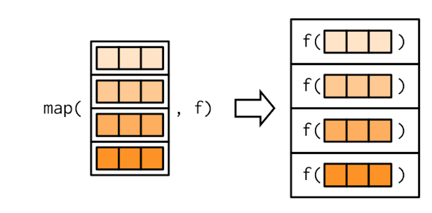
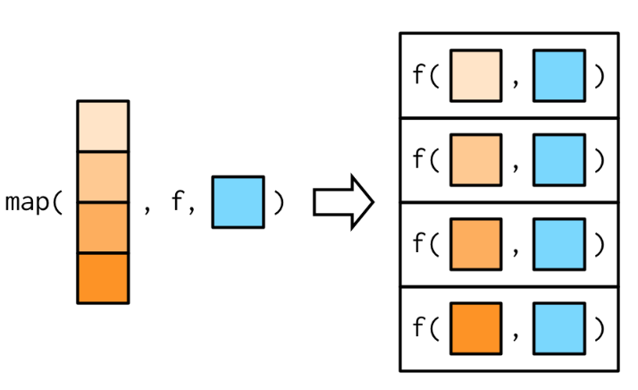
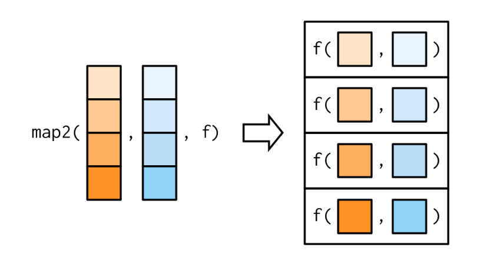

<script src="js/hideOutput.js"></script>

# Takeaways from today

* How to use and write custom functions

* What is a functional?

* Using `purrr` map family functions

Libraries for today:
```{r libs, warning=FALSE, message=FALSE}
#install.packages('fivethirtyeight','dplyr','broom','ggplot2','purrr', dependencies = T)
library(fivethirtyeight)
library(dplyr)
library(broom)
library(ggplot2)
library(purrr)
```

## About the data
```{r dat, warning=FALSE, message=FALSE}
data(bechdel)
```

This data set contains the raw data behind the 538 story ["The Dollar-And-Cents Case Against Hollywood's Exclusion of Women"](https://fivethirtyeight.com/features/the-dollar-and-cents-case-against-hollywoods-exclusion-of-women/). The Bechdel test provides a PASS/FAIL for movies based on three criteria:

1. The movie has to have at least two women in it,

2. who talk to each other,

3. about something besides a man

The variables I'll use are the following:

* `year` - year of movie release
* `binary` - Bechdel Test PASS vs FAIL binary
* `budget_2013` - Budget in 2013 inflation adjusted dollars
* `domgross_2013` - Domestic gross (US) in 2013 inflation adjusted dollars

# Function Basics

If you use R, you are probably already using many built-in R functions. A **function** is a block of organized, reusable code that is used to perform a single, related action.

## Why write your own functions? 

DRY Principle - don't repeat yourself

```{r fn1, warning=FALSE, message=FALSE}
bech_2011 <- bechdel %>% 
  filter(year == 2011) %>% 
  group_by(binary) %>% 
  summarise(med_budget = median(budget_2013))

bech_2012 <- bechdel %>% 
  filter(year == 2012) %>% 
  group_by(binary) %>% 
  summarise(med_budget = median(budget_2013))

bech_2013 <- bechdel %>% 
  filter(year == 2013) %>% 
  group_by(binary) %>% 
  summarise(med_budget = median(budget_2013))
```

A loop could do the trick, but is not as customizable for the user as we'd like.

```{r fn2, warning=FALSE, message=FALSE}
bech_yr <- function(yr){
  return(bechdel %>% 
    filter(year == yr) %>% 
    group_by(binary) %>% 
    summarise(med_budget = median(budget_2013)))
}
#Check that this yields identical results
all.equal(bech_2011, bech_yr(2011))
```

## Scoping
How did my previous function find the data? I didn't tell it where to look. Also, I used a bunch of other `dplyr` functions (verbs) in my custom functions.

R uses **lexical scoping**. This means that names defined inside a function mask names defined outside a function. If a name isn’t defined inside a function, R looks one level up. The same rules apply if a function is defined inside another function. 

- First, R looks inside the current function. 

- Then, it looks where that function was defined (and so on, all the way up to the global environment). 

- Finally, it looks in other loaded packages.

Sometimes, it can be smart to add *explicit* arguments to your function rather than relying on users to have everything loaded correctly around it. It can also be helpful to add default argument values to help your users.

In this case I defaulted `bech_data` to have the data set I anticipate in the environment. 

```{r fn3, warning=FALSE, message=FALSE}
bech_yr2 <- function(yr, bech_data = bechdel){
  return(bech_data %>% 
    filter(year == yr) %>% 
    group_by(binary) %>% 
    summarise(med_budget = median(budget_2013)))
}
```

## Syntactical flexibility

There are several ways to define and use the same function; be consistent to enhance readability!

<div class="fold o">
```{r fn }
bech_yr3 <- function(yr, bech_data = bechdel) bech_data %>% 
    filter(year == yr) %>% 
    group_by(binary) %>% 
    summarise(med_budget = median(budget_2013))

#Using argument names
bech_yr3(yr = 2011, bech_data = bechdel)

#No argument names
bech_yr3(2011, bechdel)

#Using the default - can get dicey
bech_yr3(2011)

```
</div>


Some other general readability advice from my experience: 

- Use {} - you will see people skipping this all over the internet! This makes your short functions consistent with your longer functions where you need braces.

- Use return - by default, the item in last line of a function is returned. However, it is helpful make explicit what is returned and mirrors other programming languages. You can only return one thing. Use a list() object if you need to return multiple items in one.

## Function components

Functions can be broken down into three components: arguments, body, and environment.
```{r properties }
my_first_function <- function(x, y) {
  return(x + y)
}

formals(my_first_function)
body(my_first_function)
environment(my_first_function)
```

You can also view a function by typing the name after it has been defined.
```{r def }
my_first_function
```

Functions can be flexible in ways you might expect (or not expect). This function can take a scalar or vector of numeric inputs and apply them in (hopefully) intuitive ways. It is important to check a range of input types to understand behavior.
<div class="fold o">
```{r flexibility }
my_first_function(1, 2)
my_first_function(c(1,1), 2)
my_first_function(c(1,1), c(2,3))
```
</div>

# Functionals

The functions I've covered so far are part of the upper left corner of this 2x2 table. However, things can get a lot more exotic. For today, I'm going to cover functionals. As seen in the table, a **functional** is a function that takes a function as an input and returns a vector as output.  

```{r fp, fig.align='left', echo=FALSE}
knitr::include_graphics("img/fp.png")
```

Example functional: note the ellipsis (...) lets you leave room for other arguments without specifying what they might be.
<div class="fold o">
```{r fnp}
set.seed(1000) #for reproducibility

#fn is a function, not a vector!
random_fn <- function(fn, ...) {
  return(fn(runif(1e3), ...))
}

random_fn(mean)
random_fn(median)
#Example including extra argument
random_fn(quantile, probs = c(0.25, 0.5, 0.75))

```
</div>

## `purrr`
`purrr` is part of R’s functional programming toolkit. It can help reduce the use of for loops and enhance code transparency. There is not always a functional to replace a for loop! Don't go crazy trying to find one if it doesn't make sense :) Additionally, the `purrr` functions are specialised to work with one-dimensional vectors. `base::apply()` is specialised to work with two-dimensional and higher vectors, i.e. matrices and arrays.

[Take a look at the cheatsheet.](https://github.com/rstudio/cheatsheets/blob/master/purrr.pdf)

## `purrr` map family functions

```{r map, fig.align='left', echo=FALSE}
knitr::include_graphics("img/map.png")
```

The map functions transform their input by applying a function to each element of a vector or list and returning a list or vector the same length as the input.

- `map()`, `map_if()`, and `map_at()` always return a list. The _if and _at variants take a predicate function .p that determines which elements of .x are transformed with .f.

- `map_lgl()` - logical, `map_int()` - integer, `map_dbl()` - double, and `map_chr()` - character return vectors of the corresponding type.

- `map_dfr()` and `map_dfc()` return data frames created by row-binding and column-binding respectively. They require `dplyr`.

### Translating a for loop to a `map`
<div class="fold o">
```{r mappp}
#Creating a named vector to store my calculations
number_of_columns <- dim(bechdel)[2]
len <- vector(length = number_of_columns)
names(len) <- names(bechdel)

#Calculating the number of unique values in each column of the data.frame
for(col in 1:number_of_columns){
  len[col] <- length(unique((bechdel[[col]])))
}

len
```
</div>

However, we can use `purrr::map()` for a neater solution.

<div class="fold o">
```{r map1}
f <- function(x){
  return(length(unique(x)))
}
#I want output as a numeric vector
map_dbl(bechdel, f)
```
</div>

Note that the function maps column by column, not to the entire data.frame.
```{r dataframe, out.width="50%", fig.align='left', echo=FALSE}

```

### Anonymous functions

Instead of using `map()` with an existing function (we created a function f above), you can create an inline *anonymous* (not saved elsewhere) functions. 

`purrr` supports a special shortcut for this kind of function:

<div class="fold o">
```{r map2}
map_dbl(bechdel, ~ length(unique(.x)))
```
</div>

You can use the pipe (%>%) in `dplyr` style syntax.

<div class="fold o">
```{r map3}
bechdel %>%
  map_dbl( ~ length(unique(.x))) 
```
</div>

Let's use some of the other map functions to see how the output format changes.

<div class="fold o">
```{r mappe3}
bechdel %>%
  map_chr( ~ length(unique(.x)))
```
</div>

We could also bind the results into a data.frame by rows:

<div class="fold o">
```{r mapper}
bechdel %>%
  map_dfr( ~ length(unique(.x)))
```
</div>

### Other map functions

- Output same type as input with `modify()`.
- Iterate over two inputs with `map2()`.
- Iterate with an index using `imap()`.
- Return nothing with `walk()`.
- Iterate over any number of inputs with `pmap()`.

I'll cover `map2()` and `imap()` briefly.

Regular map can only apply a function to one input. Other inputs are applied to all iterations.
```{r other, fig.align='left', echo=FALSE}

```

`map2()`

Now your function can have two inputs - x and y
```{r othermap2, fig.align='left', echo=FALSE}

```

Taking a weighted mean:
<div class="fold o">
```{r weight}
#List of 8 vectors filled with 10 random uniform(0,1) values
#Cool trick for generating random vectors!!!
xs <- map(1:8, ~runif(10))
#Giving weights to the values in xs based on their relative size
ws <- map(xs, ~ .x/sum(.x))
#Calculating a weighted mean
map2_dbl(xs, ws, weighted.mean)
```
</div>

`imap()`
If y is an index or names of x, you can use imap instead of map2.
`imap(x, f) = map2(x, y = names(x), f)`

Note you still get all of the output variants (dbl, chr, etc.)

<div class="fold o">
```{r weight2}
names(xs) <- paste0('rladies', 1:8)
#Printing out the first value and labeling the index
imap_chr(xs, ~ paste0("The first value of ", .y, " is ", .x[[1]]))
```
</div>

### A more interesting use case for mapping functions

I want to fit a logistic regression to understand if any changes occur over the decades. First, I create a time varible and a binary test variable.

<div class="fold o">
```{r map5, out.width="75%", fig.align='left'}

bechdel_mod <- bechdel %>%
  mutate(time_factor = case_when(year %in% 1970:1979 ~ '1970s',
                                 year %in% 1980:1989 ~ '1980s',
                                 year %in% 1990:1999 ~ '1990s',
                                 year %in% 2000:2009 ~ '2000s',
                                 year %in% 2010:2019 ~ '2010s'),
         bechdel_test = case_when(binary == 'PASS' ~ 0,
                                  binary == 'FAIL' ~ 1))
```
</div>


Then, I split the data into list of data.frames by the time factor.
<div class="fold o">
```{r map6}
by_time <- split(bechdel_mod, bechdel_mod$time_factor)
by_time
```
</div>

Now I fit my logistic regression using the 2013 inflated budget and domestic gross of the movie to predict whether or not it will pass the bechdel test.
<div class="fold o">
```{r map7}
modeled_bech <- by_time %>% 
  #Fit logistic regression
  map(~ glm(bechdel_test ~ budget_2013 + domgross, 
            family = 'binomial', data = .x)) %>% 
  #Using broom::tidy to make the output nicer for processsing
  map(~ tidy(.x)) %>%
  #Grabbing variable names and point estimates
  map(~ select(.x, term, estimate, std.error)) %>%
  #Getting the list indices into the data set
  imap(~ mutate(.x, decade = .y)) %>%
  #Recombining everything into a data.frame
  bind_rows() 

modeled_bech
```
</div>

Now plotting the results
```{r map8, fig.align='left'}
  modeled_bech %>%
  ggplot(aes(x = decade, y = estimate, group = term)) + 
  geom_point() + 
  #adding error bars
  geom_errorbar(aes(x = decade, 
                    ymin = estimate - 2 * std.error, 
                    ymax = estimate + 2 * std.error), 
                color = 'grey50', width = 0.2) + 
  #making the lines a little thicker
  geom_line(lwd = 1.2) + 
  #highlighting the x-axis
  geom_hline(yintercept = 0) + 
  #allowing different scales on each coefficient
  facet_wrap(~term, scales = 'free_y') + 
  #not a fan of the default plotting
  theme_bw() +
  #removing grid, changes facet title colors
  theme(panel.grid = element_blank(), 
        strip.background = element_rect(fill = 'black'), 
        strip.text = element_text(color = 'white')) + 
  xlab('Decade') + ylab('Estimated Coefficient')

```
Conclusions:

* Higher probability of failing Bechdel test in high budget movies in recent decades (action movies have higher budget?)

* Lower probability of failing Bechdel test in high gross movies in 2010s (is the audience paying attention to the presence of women?)

## More stuff in `purrr`

* Reduce family functions
    + `reduce()` takes a vector of length n and produces a vector of length 1 by calling a function with a pair of values at a time: reduce(1:4, f) is equivalent to f(f(f(1, 2), 3), 4).
    + `accumulate()` is useful for understanding how reduce works, because instead of returning just the final result, it returns all the intermediate results as well.

* Predicate functions
    + Returns a single TRUE or FALSE.
    + `some(.x, .p)` returns TRUE if any element matches; `every(.x, .p)` returns TRUE if all elements match.
    + `detect(.x, .p)` returns the value of the first match; `detect_index(.x, .p)` returns the location of the first match.
    + `keep(.x, .p)` keeps all matching elements; `discard(.x, .p)` drops all matching elements.

# References

- [R for Data Science (Chapter 19 Functions)](https://r4ds.had.co.nz/functions.html)
- [Advanced R (Section II Functional Programming)](https://adv-r.hadley.nz/fp.html)
- [purrr cheatsheet](https://github.com/rstudio/cheatsheets/blob/master/purrr.pdf)